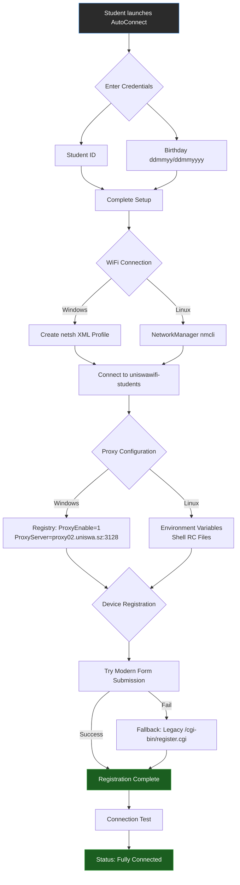
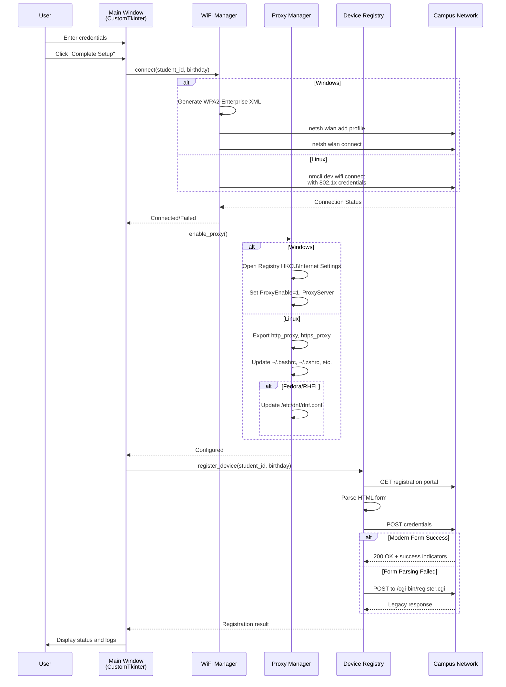
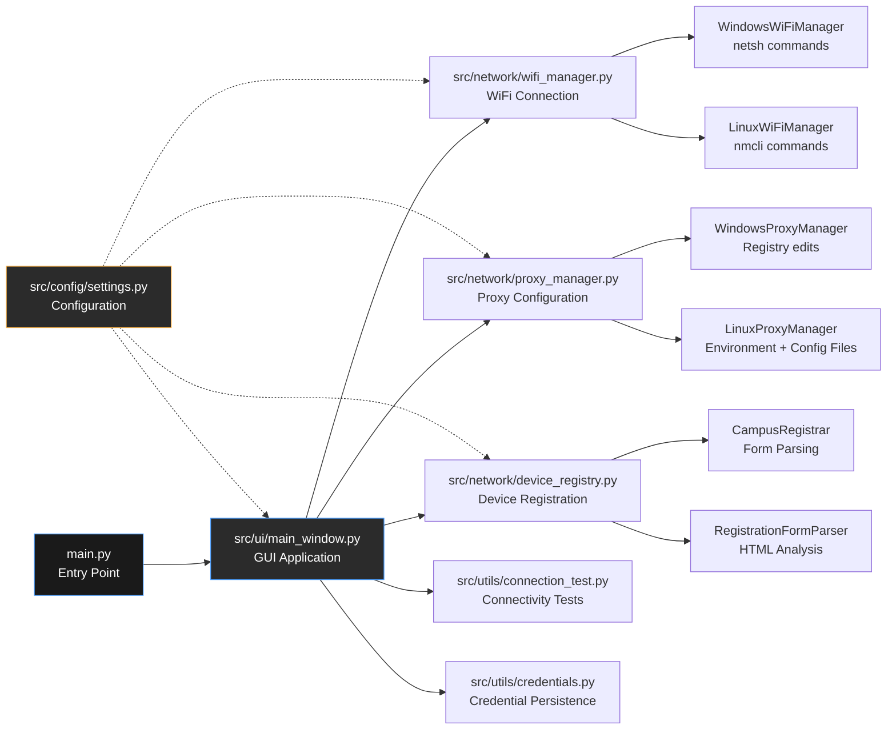

# UNESWA WiFi AutoConnect
by: Project Manager of 2025, Vezokuhle Simelane
Involved Members: Vezokuhle Simelane (as of October 2025)
![[1696151530414-3878160955.jpeg]]
## The Problem

Getting onto campus WiFi is a pain. When the IT Center is closed or there's no one around who knows how to help, students end up using mobile data for assignments and course materials. That gets expensive fast on a student budget.

The WiFi itself has quirks. YouTube and large downloads are blocked (makes sense for bandwidth), but it's annoying when you need educational content. Linux users have it worse because the instructions are Windows-only or don't exist. Even after connecting, package managers like `dnf`, `apt`, and `pacman` break because proxy setup is different on every distro.

AutoConnect fixes this. Type your credentials once, click a button, and it handles WiFi, proxy, and device registration. You don't need to know what WPA2-Enterprise is or how to edit config files.

Dark mode only. No light mode. Deal with it.

## What It Does

  



  

### Core Features

- **One-click WiFi** - Connects to `uniswawifi-students` using WPA2-Enterprise
- **Proxy setup** - Configures `proxy02.uniswa.sz:3128` on Windows and Linux
- **Device registration** - Submits to the netreg portal automatically
- **Saves credentials** - Remembers your Student ID and birthday
- **English/siSwati** - Language toggle in the UI
- **Status monitoring** - Checks connection every 30 seconds
- **Dark mode only** - Light mode is disabled
## Technical Architecture
### System Workflow

  



  

### Module Breakdown

  



  

## Why the Code Looks Complicated

You might look at the code and think "this is way too much for WiFi." It's not. Different systems handle network config in completely different ways, so the code has to deal with all of them.
### Linux Proxy Mess

Package managers don't respect the same proxy settings. This isn't a bug, it's just how Linux works.

- **Ubuntu/Debian** - Environment variables usually work. Set `http_proxy` and `https_proxy` in your shell.
- **Arch/Manjaro** - `pacman` follows environment variables, but you need `/etc/environment` for system-wide persistence.
- **Fedora/RHEL/CentOS** - DNF ignores environment variables entirely. You need `proxy=` in `/etc/dnf/dnf.conf` or it won't work even when Firefox does.

The code handles shell files (`.bashrc`, `.zshrc`), system environment files, and distro-specific configs. It also tries to set GNOME and KDE desktop proxies when possible.
### Windows Quirks

Windows WiFi profiles need XML files with specific EAP config blocks. The profile needs `<cacheUserData>true</cacheUserData>` or Windows will ask for credentials every time.

Even with that, Windows makes you enter credentials once manually before it caches them. The app shows what to type when that happens.

For proxy, Windows uses the registry at `HKCU\Software\Microsoft\Windows\CurrentVersion\Internet Settings`. Set `ProxyEnable` to 1 and `ProxyServer` to the address, then refresh with WinINet.

  

## Configuration Details
### WiFi Settings

- **SSID**: `uniswawifi-students`

- **Security**: WPA2-Enterprise

- **EAP Method**: PEAP (Protected EAP)

- **Phase 2 Auth**: MSCHAPv2

- **Username**: Student ID (e.g., `2021/1234` or `20211234`)

- **Password**: `Uneswa` + birthday in `ddmmyyyy` format (e.g., `Uneswa12052001`)
### Proxy Settings

- **Host**: `proxy02.uniswa.sz`
- **Port**: `3128`
- **Protocol**: HTTP (not HTTPS)
- **Type**: Manual proxy (not PAC/automatic)
### Device Registration Endpoints

- **Primary**: `https://netreg.uniswa.sz`
- **Campuses**:

  - Kwaluseni: `http://kwnetreg.uniswa.sz`

  - Luyengo: `http://lynetreg.uniswa.sz`

  - Mbabane: `http://mbnetreg.uniswa.sz`
## Known Issues and Workarounds
### Package Managers Still Fail After Proxy Setup
This happens when the proxy is configured for your user session but not system-wide. On Linux:
1. Check if environment variables are set: `echo $http_proxy`
2. For Fedora/RHEL, verify `/etc/dnf/dnf.conf` has `proxy=http://proxy02.uniswa.sz:3128`
3. For Arch, ensure `/etc/environment` has proxy exports
4. Restart your terminal or run `source ~/.bashrc`
### Windows Keeps Prompting for Credentials
This is expected on first connection. Windows needs to cache your 802.1X credentials. When prompted:
1. Enter your Student ID as the username
2. Enter `Uneswa` + your birthday in `ddmmyyyy` format as the password
3. **Check "Remember my credentials"** to avoid future prompts
After the first successful connection, Windows caches the credentials in the profile.
### Linux: NetworkManager Doesn't Use the Proxy for System Services

Environment variables set in shell files only affect user sessions. System services need `/etc/environment` entries. The app tries to handle this, but some distributions ignore `/etc/environment` for services.

For system-wide proxy on Linux:

```bash

sudo vim /etc/environment

```

Add:

```

http_proxy="http://proxy02.uniswa.sz:3128"

https_proxy="http://proxy02.uniswa.sz:3128"

```

Then restart your session.
## Usage
### Basic Flow
1. Launch the app: `python main.py`
2. Enter your Student ID (e.g., `2021/1234`)
3. Enter your birthday in `ddmmyy` or `ddmmyyyy` format (e.g., `120500` or `12052000`)
4. Click "Complete Setup" or press `Ctrl+Enter`
5. Wait for the operations to complete (WiFi → Proxy → Registration)
6. Check the activity log for status messages
### Individual Actions
If you only need specific operations:
- **WiFi Only**: Connects to WiFi without configuring proxy or registering device
- **Proxy Only**: Configures system proxy without touching WiFi
- **Register Device**: Submits device registration (requires WiFi and proxy to work)
- **Test Connection**: Runs connectivity tests to verify everything works
- **Reset UNESWA**: Removes UNESWA WiFi profiles and proxy settings (other networks untouched)
### Keyboard Shortcuts
- `Ctrl+Enter` or `F5`: Complete Setup
- `Ctrl+T`: Test Connection
- `Ctrl+R`: Reset UNESWA Settings
- `F1`: Help Dialog
- `Ctrl+Q`: Quit
- `Tab`: Navigate between input fields
### CLI Diagnostics
Check system compatibility:
```bash

python src/main.py --check

```
Show system information:
```bash

python src/main.py --system-info

```
Enable debug logging:

```bash

python src/main.py --debug

```
## Security and Privacy
### Credential Storage
The app saves your Student ID and birthday in plain JSON for convenience:

- **Windows**: `%APPDATA%\UNESWAWiFi\credentials.json`

- **Linux**: `~/.config/uneswa-wifi\credentials.json`
This is local-only storage. If you prefer not to persist credentials, delete the file after use or don't save them when prompted.
### Password Generation
Your password is generated as `Uneswa` + birthday in `ddmmyyyy` format. The app normalizes various input formats:
- `120500` → `12052000` → `Uneswa12052000`
- `12052000` → `Uneswa12052000`
- `Uneswa12052000` → `Uneswa12052000` (already complete)  
The birthday validation checks that day is 1-31 and month is 1-12. Year is assumed 2000-2099 for 2-digit years.
### File Modifications
The app modifies system files with backups:
- **Linux**: Creates `.uneswa_backup` files before editing shell configs
- **Windows**: Registry changes are reversible via the Reset action
- **Fedora DNF**: Creates temp files and uses `sudo cp` to update `/etc/dnf/dnf.conf`
All changes are scoped to UNESWA-specific settings. Other WiFi networks and proxy configs are preserved.
## Development and Extension
### Project Structure

  

```

AutoConnect/

├── src/

│   ├── main.py                    # Entry point with CLI args

│   ├── config/

│   │   ├── settings.py            # All configuration constants

│   │   └── __init__.py

│   ├── network/

│   │   ├── wifi_manager.py        # WiFi connection logic

│   │   ├── proxy_manager.py       # Proxy configuration logic

│   │   ├── device_registry.py     # Device registration logic

│   │   └── network_manager.py     # Unified network operations

│   ├── ui/

│   │   ├── main_window.py         # Primary GUI application

│   │   └── components.py          # Reusable UI components

│   └── utils/

│       ├── connection_test.py     # Connectivity testing

│       ├── credentials.py         # Credential persistence

│       ├── system_utils.py        # OS detection and commands

│       └── process_manager.py     # Process execution helpers

├── docs/

│   └── AutoConnect.md             # This file

├── assets/

│   └── icon.ico                   # Application icon

├── requirements.txt               # Python dependencies

├── main.py                        # Root launcher

└── README.md                      # Quick start guide

```
### Key Design Decisions

**CustomTkinter** - Cross-platform, looks native, has dark mode, performs better than vanilla Tkinter.

**Not Electron** - CustomTkinter uses 30-50MB, Electron uses 200-300MB. Student laptops don't have RAM to waste. Also I don't know Electron.

**Dark mode only** - Reduces eye strain in labs and looks better. Light mode was intentionally disabled. Not adding it back.

**Credential caching** - Students use this multiple times per semester. Retyping credentials every time is annoying.

**Complex proxy code** - Linux distros can't agree on how proxies work. The code handles the common cases so people stop asking for help.
### Adding Distribution Support
To add a new Linux distribution:
1. Edit `src/config/settings.py`

2. Add an entry to `LINUX_SETTINGS["distro_configs"]`

3. Specify proxy setup method (`environment_vars` or `dnf_config`)

4. Add any distribution-specific config files

5. Test on the target distro

Example for a hypothetical Gentoo config:

```python

"gentoo": {

    "proxy_setup": "environment_vars",

    "additional_files": ["/etc/portage/make.conf"],

    "commands": ["sudo rc-service NetworkManager restart"],

}

```

### Extending Registration Logic

If registration endpoints change or new campuses are added:
1. Update `REGISTRATION_ENDPOINTS` in `src/config/settings.py`

2. Add campus-specific handling in `device_registry.py` if form structure differs

3. Test connectivity to the new endpoint

4. Update legacy fallback URLs if needed

  

### Testing
Manual testing checklist:

- [ ] WiFi connection works on Windows

- [ ] WiFi connection works on Linux (NetworkManager)

- [ ] Proxy configuration persists after app closes

- [ ] Package manager respects proxy (test with `dnf check-update` or `pacman -Sy`)

- [ ] Device registration succeeds (check logs)

- [ ] Connection test passes after full setup

- [ ] Reset removes only UNESWA settings, not other networks

- [ ] Credentials are saved and loaded correctly

- [ ] Language toggle works

- [ ] Dark mode remains enforced

  

## Contributing

1. Fix real problems - broken package managers, new campus endpoints, actual student pain points
2. Test on cheap laptops if you can
3. Don't touch dark mode
4. Write normal comments, not AI documentation
5. Don't over-engineer - solve the actual problem, not theoretical future problems

This project exists to help students get online. Keep that in mind.
## Support

For issues:

1. Run `python src/main.py --check` and include the output

2. Include your OS and version (Windows 10/11, Ubuntu 22.04, Fedora 38, etc.)

3. Paste relevant logs from the activity log

4. Describe what you expected vs what happened

The most common issues are Fedora DNF configs and Windows credential prompts. Read the workarounds section before filing a bug.

---

**Status**: Active  
**Version**: 1.2.5  
**Maintained by**: ICT Society, UNESWA  
**License**: MIT

Student-built for students. Not perfect, but it works. If you find bugs, fix them. If it helps you, pass it on.

---

Lunsford, S. K. (2020). Addressing the digital divide: Technology access barriers in higher education. *Journal of Educational Technology Systems*, 49(2), 166-192. https://doi.org/10.1177/0047239520943231

Microsoft Corporation. (2019). *Windows 802.1X authentication and network access control*. Microsoft Docs. https://docs.microsoft.com/en-us/windows-server/networking/core-network-guide/cncg/wireless/wireless-deployment

Red Hat, Inc. (2023). *DNF package manager documentation*. https://dnf.readthedocs.io/

Zettler, R., & Straub, J. (2016). Student experiences with technology barriers in online learning environments. *Journal of College Student Development*, 57(6), 725-741. https://doi.org/10.1353/csd.2016.0073

https://learn.microsoft.com/en-us/windows/security/identity-protection/credential-guard/considerations-known-issues

https://itm4n.github.io/peap-credentials-wired-connections/